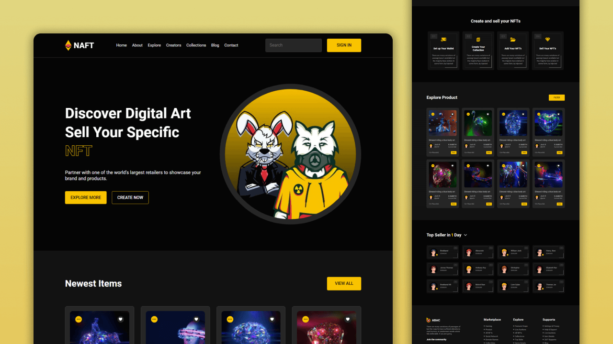
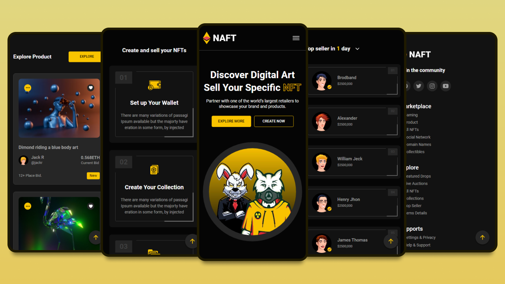

# NAFT - NFT Marketplace

NAFT is a fully responsive nft marketplace website, responsive for all devices, built using HTML, CSS, and JavaScript.

## Demo

## Prerequisites

Before you begin, ensure you have met the following requirements:

## Installing NAFT

To install **NAFT**, follow these steps:

Linux and macOS:

Windows:

## Contact

## License

This project is **free to use** and does not contains any license.

